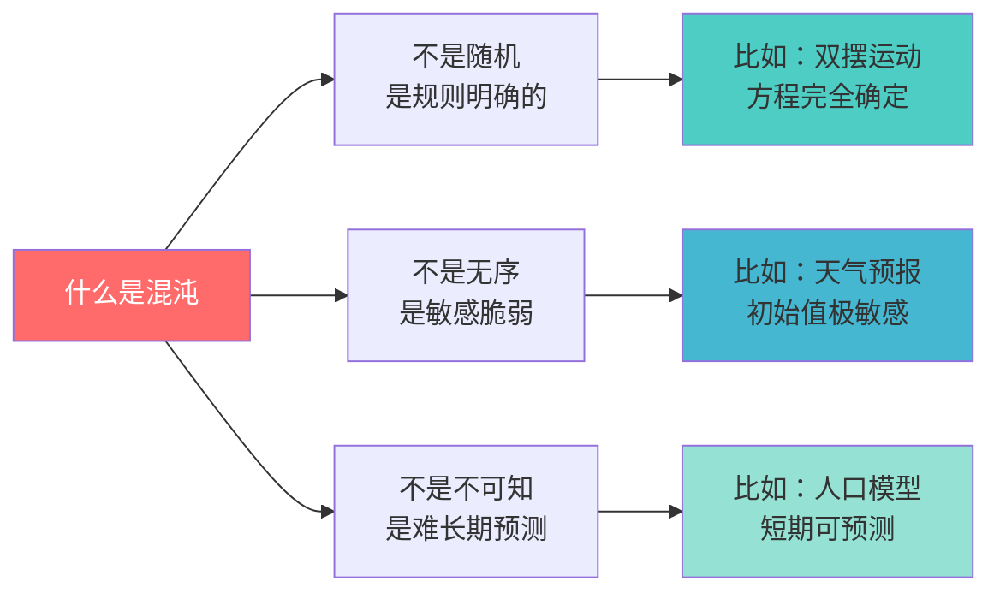
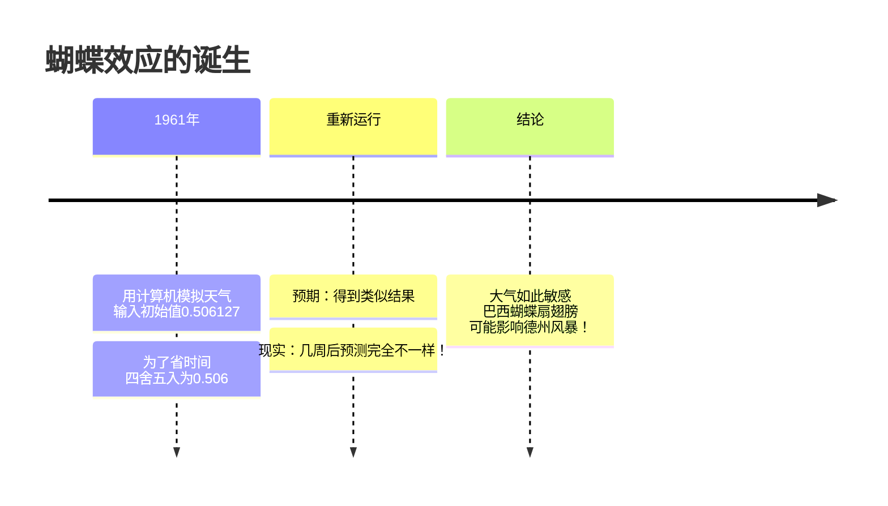
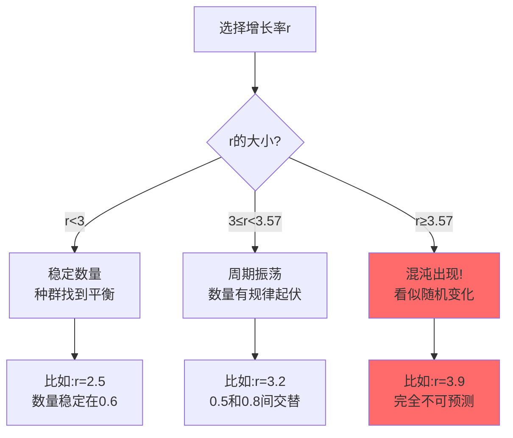
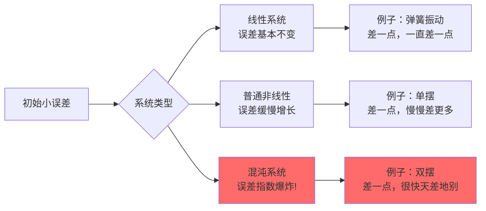

# 🦋 混沌理论：当蝴蝶扇动了翅膀

## 🎯 一句话秒懂
> **微小改变 → 巨大影响**  
> 就像多米诺骨牌的第一块倒向左边还是右边，最终会导致完全不同的图案！

---

## 📊 知识地图：3分钟看懂混沌


---

## 🎮 动手实验：体验“蝴蝶效应”

### 实验1：数字的奇妙旅行
> 同一个简单规则，微小差异会走向何方？

```python
# 简单到不可思议的混沌公式
def 数字游戏(x, 步数=30):
    """x → 3.9*x*(1-x) 反复迭代"""
    轨迹 = []
    for i in range(步数):
        x = 3.9 * x * (1 - x)  # 只有乘法和减法！
        轨迹.append(x)
    return 轨迹

# 试试两个几乎相同的起点
轨迹A = 数字游戏(0.3)
轨迹B = 数字游戏(0.3000001)  # 只差0.0000001！

print("第30步时：")
print(f"轨迹A: {轨迹A[-1]:.8f}")
print(f"轨迹B: {轨迹B[-1]:.8f}")
print(f"差异：{abs(轨迹A[-1]-轨迹B[-1]):.8f}")
```

**🤔 你会发现**：虽然开始只差一点点，但30步后，这两个“双胞胎数字”已经走上了完全不同的人生道路！

### 实验2：纸上也能玩混沌
> 不用电脑，用计算器就能玩

**规则**：
1. 任选一个0到1之间的数（比如0.4）
2. 计算：`新数 = 3.9 × 旧数 × (1-旧数)`
3. 重复20次，记录每次结果
4. 换一个很接近的数（比如0.4001）再来一次

**观察**：两条路径什么时候开始“分道扬镳”？

---

## 🌪️ 发现故事：一只“蝴蝶”改变了科学

### 天气预测的意外
> **时间**：1961年  
> **人物**：气象学家爱德华·洛伦兹  
> **地点**：麻省理工学院

**发生了什么**：


**洛伦兹的感叹**：
> “如果实际大气像这个模型一样运作，那么一只海鸥扇动翅膀就足以永远改变天气。”

后来，“海鸥”变成了更有诗意的“**蝴蝶**”。

---

## 🧩 三大经典混沌模型

### 1. **逻辑斯谛映射**：种群的过山车
> 描述动物数量变化的简单模型

$$
P_{\text{明年}} = r \times P_{\text{今年}} \times (1 - P_{\text{今年}})
$$

**r代表增长率**，不同r值导致完全不同结果：



### 2. **洛伦兹吸引子**：数学的蝴蝶
> 描述大气对流的三个方程

看起来复杂，但思想很简单：
- 三个变量：x（对流强度），y（水平温差），z（垂直温差）
- 微小变化会被指数放大
- 轨迹像一只蝴蝶的翅膀

### 3. **双摆**：看得见的混沌
> 两个摆连在一起的运动

**在家可以试试**：
1. 用绳子和重物做两个摆
2. 第一次：轻轻释放
3. 第二次：几乎完全一样地释放
4. 观察：几分钟后，运动还一样吗？

**科学事实**：
- 双摆的运动完全由牛顿定律决定
- 但实践中不可能完全相同地释放
- 微小差异 → 完全不同的舞蹈

---

## 🌍 生活中的混沌现象

### 表格：混沌就在身边

| 生活场景 | 混沌体现 | 你的体验 |
|---------|---------|---------|
| **天气** | 两周以上的预报不准 | 说好的晴天突然下雨 |
| **交通** | 一个急刹引起大堵车 | 高速路上的“幽灵堵车” |
| **学习** | 小习惯改变大成绩 | 每天多学15分钟的累积效果 |
| **社交** | 一句话改变关系走向 | “如果当时没说那句话...” |
| **游戏** | 初期选择决定结局 | RPG游戏的多重结局 |

### 特别关注：**你的心脏也是混沌的！**

```ad-note
title: 心跳的奥秘
collapse: open

**健康的心跳**：
- 每次间隔不完全相同
- 有微小的自然变化
- 像一首有即兴的爵士乐

**生病的心跳**：
- 过于规律整齐
- 缺乏变异性
- 像机械的节拍器

**科学发现**：混沌的心跳 = 健康的标志！
```

---

## 🎯 重点概念辨析

### 混沌 vs 随机：找不同！

| 特征 | 混沌系统 | 随机系统 |
|------|---------|---------|
| **规则** | 有明确公式 | 真的没规则 |
| **例子** | 双摆、天气 | 掷骰子、放射性衰变 |
| **预测性** | 短期可预测 | 完全不可预测 |
| **重复性** | 相同条件→相同结果 | 相同条件→不同结果 |

**一句话记住**：
- 混沌：**知道规则但难预测**（像猜朋友反应）
- 随机：**根本没有规则**（像掷骰子）

### 敏感度大比拼



---

## 🧠 数学背后的直觉

### 李雅普诺夫指数：敏感度的“温度计”
> 衡量系统对初始条件的敏感程度

**直观理解**：
- **正指数**：混沌系统（误差指数增长）
- **零指数**：临界状态（误差线性增长）
- **负指数**：稳定系统（误差衰减）

**生活比喻**：
- 负指数：谣言逐渐消失
- 零指数：谣言匀速传播
- 正指数：谣言指数级传播 → 混沌！

---

## 💡 对学习生活的启示

### 1. **微小习惯的巨大力量**
> 混沌理论告诉我们：每天微小的选择，长期会产生巨大差异

**学习中的应用**：
- 每天多学15分钟 → 一年多出91小时！
- 每次作业认真检查 → 考试时成为本能
- 今日的一个问题 → 明日的一个突破

### 2. **接受不确定性**
> 有些系统天生难以长期预测，这不是我们的错

**心态调整**：
- 尽力准备，接受意外
- 关注过程，看淡单次结果
- 从错误中学习，而不是恐惧错误

### 3. **寻找混沌中的模式**
> 混沌不是混乱，其中有隐藏的结构

**思维训练**：
- 在复杂问题中寻找简单规则
- 在变化中寻找不变的关系
- 在随机表象下寻找确定性

---

## 🎓 关联你的课本知识

### 数学联系
- **函数迭代**：`f(x) = 3.9x(1-x)`就是反复代进去
- **指数增长**：误差的指数放大
- **非线性**：不是y=kx那么简单的关系

### 物理联系
- **牛顿定律**：双摆完全遵守这些定律
- **确定性**：给足够信息，理论上可预测一切
- **测量精度**：现实中总有误差

### 计算机联系
- **模拟仿真**：用计算机探索混沌行为
- **数值误差**：计算机的舍入误差也会被放大
- **可视化**：让数学变得看得见

---

## ❓ 思考与讨论

### 问题1：你的“蝴蝶效应”
> 回想一下，你生活中是否经历过“微小选择导致巨大不同”的时刻？

### 问题2：可预测的极限
> 如果知道地球上每个空气分子的位置，我们能准确预测一个月后的天气吗？

### 问题3：混沌是好事吗？
> 心脏混沌=健康，天气混沌=难预测。混沌到底是好是坏？

### 问题4：你的学习系统
> 你的学习习惯是一个“稳定系统”还是“混沌系统”？如何让它更有效？

---

## 🚀 扩展探索

### 如果想深入了解...
1. **分形**：混沌的几何语言（曼德博集合超美！）
2. **复杂系统**：多个混沌系统的相互作用
3. **控制混沌**：利用混沌的特性做有用的事
4. **量子混沌**：微观世界的混沌现象

### 推荐资源
- **视频**：3Blue1Brown的混沌系列（B站有中文）
- **游戏**：《混沌模拟器》App，亲手玩转混沌
- **网站**：Wolfram的混沌演示（不用懂代码也能玩）
- **书籍**：《混沌：开创新科学》（科普经典）

---

## 📝 本章要点总结

| 关键词 | 含义 | 一句话记住 |
|-------|------|-----------|
| **蝴蝶效应** | 微小改变导致巨大差异 | 巴西蝴蝶→德州风暴 |
| **确定性混沌** | 有规则但难预测 | 知道公式但猜不准 |
| **敏感依赖性** | 初始小误差指数放大 | 差之毫厘，谬以千里 |
| **逻辑斯谛映射** | 最简单的混沌模型 | `x → rx(1-x)`的魔力 |
| **洛伦兹吸引子** | 天气混沌的数学描述 | 数学的蝴蝶翅膀 |

---

> 🦋 **记住：**  
> **混沌不是世界的bug，而是世界的feature。**  
> **它让天气多变，让心跳健康，**  
> **也让你的每个小选择都充满力量。**

---

**最后更新**：{{2026-01-22}}  
**适合年级**：高中全年级  
**关联章节**：函数迭代、非线性关系、指数增长

---

### ✨ 课后小任务
1. 用计算器玩“数字游戏”，感受混沌
2. 观察三天天气预报的变化，记录准确率
3. 思考：如何让你的学习系统“健康地混沌”？

