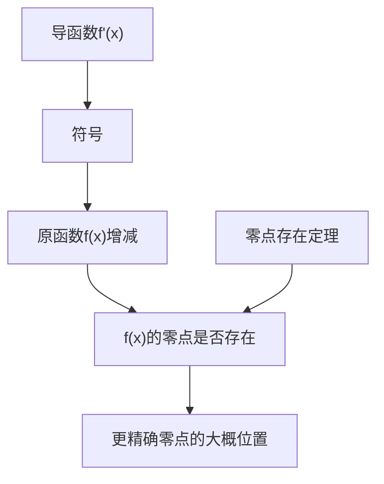
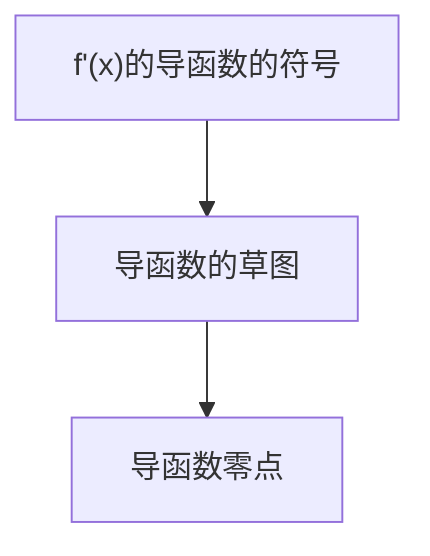
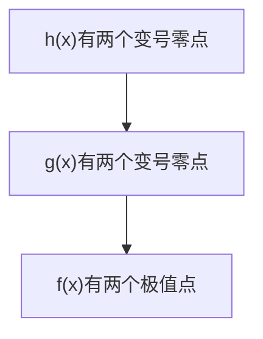

>[!note] 1.先理解导数的作用
>导数主要针对就是复杂函数问题，具体来讲是研究单调性、极值和零点
>换种说法其实就是利用导数来构建原函数的草图
>四个基本函数为例

![[202603123|400]]

![[202603124]]
![[202603125]]
![[Projects/Excalidraw/202603126|202603126]]

>[!tip] 提示
>这几个函数，一次求导我们就可以画出其图像，
>因为一次求导后导数的零点(原函数极值点)是确定可求的
>所以最终我们研究导数的主要目的有时候就是为了求导数的零点（原函数极值点）
>只要导数的零点（原函数极值点）确定，很多问题就清晰了
>

| x       | 范围1 | 极值点1 | 范围2 | 极值点2 | 范围3 | ... |
| ------- | --- | ---- | --- | ---- | --- | --- |
| $f'(x)$ | 符号  | 0    | 符号  | 0    | 符号  |     |
| $f(x)$  | 增减  | 极值   | 增减  | 极值   | 增减  |     |
>[!danger] 表格
>表格所代表的其实就是函数$f(x)$的图像（特征）
>

有了表格和草图，我们就可以判断原函数的极值，单调性和零点

>[!question] 什么时候需要二次求导
>当一次求导无法确定极值点（隐零点）
>但是又需要非常准确的知道原函数$f(x)$的变化趋势（草图），以研究$f(x)$的
>最值，零点，证明时，问题就变成了通过二次求导，研究$f'(x)$的零点，进而得到$f(x)$极值点的情况
>所以问题的关键是中在$f'(x)=0$和$f''(x)=0$的研究

>[!success] 举例
>先看函数的极值处理
>已知函数$f(x)=\dfrac{2}{3}x^3-\dfrac{3}{2}x^2-2ae^x$有两个极值点，求实数$a$的取值范围

>[!tip] 思考过程
>第一步目标:我想画$f(x)$的草图，需要知道的信息$\color{red}单调区间，极值点和零点$
>而这一切都需要$f'(x)$符号+零点来完成
>$f'(x)=2x^2-3x-2ae^x$要求导函数有两个变号零点

>[!question] 问题出现
>显然$f'(x)=2x^2-3x-2ae^x$无法直接确定零点和符号

但是问题已经转化为研究导函数的零点问题

>[!success] 第二步：
>下面研究$f'(x)=2x^2-3x-2ae^x=0$
>令$g(x)=f'(x)=2x^2-3x-2ae^x$这种写法会用到第三次求导，所以要改变一下策略
>$f'(x)=2x^2-3x-2ae^x=e^x(\dfrac{2x^2-3x}{e^x}-2a)，e^x>0$
>令$h(x)=\dfrac{2x^2-3x}{e^x}-2a$

>[!tip] 小技巧
>对数单身狗，指数找朋友

>[!question] 继续
>研究$h(x)=\dfrac{2x^2-3x}{e^x}-2a$有两个变号零点
>$h'(x)=-\dfrac{(2x-1)(x-3)}{e^x}$
>利用$h'(x)$就可以去研究$h(x)$的草图
>$(-\infty,\dfrac{1}{2})$递减，$(\dfrac{1}{2},3)$递增，$(3,+\infty)$递减
>除了单调性加入对$h(x)$的符号判断
>![[202603128]]
>这是$\varphi(x)=\dfrac{2x^2-3x}{e^x}$的草图
>$h(x)=\dfrac{2x^2-3x}{e^x}-2a$可能是
>![[202603129]]
>$0<2a<\varphi(\dfrac{1}{2})=-\dfrac{1}{\sqrt e}$

>[!success] 结论
>无论函数怎么变，流程都是一样的
>那就是坚持研究$f(x)$的草图如何画，$f'(x)$的草图如何画
>导数就是为画草图服务的

