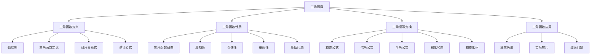

# 📐 三角函数 - 教学指南

## 🎯 教学总览

**三角函数**是研究周期性现象的重要数学工具，是连接几何与代数的桥梁。它在物理、工程、天文等领域有广泛应用。本教案体系按照"定义-性质-变换-应用"的逻辑顺序编排。

### 📊 知识地图

## 📚 章节导航

### 第一章：三角函数定义 (6课时)
- **1.1** [[1三角函数定义/弧度制2.md|弧度制]] 🌟🌟
  - 弧度制的定义
  - 弧度与角度的换算
  
- **1.2** [[1三角函数定义/三角函数的定义.md|三角函数的定义]] 🌟🌟
  - 任意角三角函数定义
  - 单位圆定义
  
- **1.3** [[1三角函数定义/同角的三角基本关系式1.md|同角三角函数关系式1]] 🌟🌟🌟
  - 平方关系
  - 商数关系
  
- **1.4** [[1三角函数定义/同角三角基本关系2.md|同角三角函数关系式2]] 🌟🌟🌟
  - 倒数关系
  - 综合应用
  
- **1.5** [[1三角函数定义/诱导公式（1）.md|诱导公式（1）]] 🌟🌟🌟
  - 诱导公式的记忆方法
  - 角变换技巧
  
- **1.6** [[1三角函数定义/诱导公式（2）.md|诱导公式（2）]] 🌟🌟🌟
  - 综合应用
  - 化简求值

### 第二章：三角函数图像和性质 (8课时)
- **2.1** [[2三角函数的图形和性质/1.三角函数的图像和性质.md|三角函数的图像和性质]] 🌟🌟🌟
  - 正弦、余弦、正切函数图像
  - 基本性质
  
- **2.2** [[2三角函数的图形和性质/2.三角函数的周期性和对称性.md|周期性和对称性]] 🌟🌟🌟
  - 周期公式
  - 对称轴和对称中心
  
- **2.3** [[2三角函数的图形和性质/3.三角函数的单调性和最值.md|单调性和最值]] 🌟🌟🌟🌟
  - 单调区间
  - 最值求法
  
- **2.4** [[2三角函数的图形和性质/4.三角函数图像性质综合应用.md|图像性质综合应用]] 🌟🌟🌟🌟
  - 综合问题
  - 参数讨论
  
- **2.5** [[2三角函数的图形和性质/5.正切函数的图像和性质.md|正切函数的图像和性质]] 🌟🌟🌟
  - 正切函数特性
  - 应用举例

### 第三章：三角函数图像变换 (4课时)
- **3.1** [[三角函数的图像变换/五点作图.md|五点作图法]] 🌟🌟
  - 五点法作图
  - 图像绘制
  
- **3.2** [[三角函数的图像变换/平移和伸缩.md|平移和伸缩变换]] 🌟🌟🌟🌟
  - 平移变换
  - 伸缩变换
  - 综合变换

### 第四章：三角恒等变换 (7课时)
- **4.1** [[4恒等变换/1.恒等变换（一）.md|恒等变换（一）]] 🌟🌟🌟🌟
  - 和差公式
  - 倍角公式
  
- **4.2** [[4恒等变换/2.恒等变换（二）.md|恒等变换（二）]] 🌟🌟🌟🌟
  - 半角公式
  - 积化和差
  - 和差化积

## 🎨 教学资源

### 📖 参考资料
- 人教版高中数学必修一
- 《三角函数解题技巧》
- 《三角恒等变换大全》

### 🛠 教学工具
- 几何画板动态演示
- 三角函数图像绘制软件
- 物理振动现象模拟

### 📝 练习题库
- 基础练习题 (80题)
- 提高练习题 (50题)
- 高考真题精选 (40题)
- 竞赛拓展题 (20题)

## 🚀 教学建议

### 课时安排建议
| 章节 | 课时 | 重点 | 难点 |
|------|------|------|------|
| 1.三角函数定义 | 6 | 定义理解 | 诱导公式 |
| 2.图像性质 | 8 | 图像特征 | 综合应用 |
| 3.图像变换 | 4 | 变换规律 | 参数影响 |
| 4.恒等变换 | 7 | 公式应用 | 技巧选择 |

### 📊 能力培养
1. **抽象概括能力** - 通过周期现象抽象
2. **数形结合能力** - 通过图像分析性质
3. **运算求解能力** - 通过恒等变换训练
4. **建模应用能力** - 通过实际问题解决

### ⚠️ 常见易错点
- 弧度制与角度制混淆
- 诱导公式符号错误
- 三角函数单调区间记错
- 恒等变换公式选择不当

## 🔗 相关链接

### 横向联系
- [[../平面向量/|平面向量]] - 解三角形的基础
- [[../函数/|函数]] - 函数概念的基础
- [[../立体几何初步/|立体几何初步]] - 空间角计算

### 纵向延伸
- 三角函数 → 反三角函数 → 复数表示
- 三角恒等变换 → 傅里叶分析 → 信号处理

## 📈 评价体系

### 形成性评价
- 课堂练习 (25%)
- 小组讨论 (25%)
- 作业完成 (30%)

### 终结性评价
- 单元测试 (20%)
- 综合应用 (25%)
- 创新思维 (5%)

## 💡 教学创新

### 数字化教学
- 使用动态软件演示三角函数图像
- 开发三角函数计算小程序
- 利用物理实验验证周期现象

### 项目式学习
- "潮汐变化预测" - 周期函数应用
- "音乐声波分析" - 傅里叶级数初探
- "钟摆运动研究" - 三角函数建模

### 个性化学习
- 分层练习题设计
- 可视化学习路径
- 错题自动分析

---

## 🔄 更新记录

| 日期 | 版本 | 更新内容 | 更新人 |
|------|------|----------|--------|
| 2026-04-12 | 1.0 | 创建三角函数教学指南框架 | 许宏杰 |

## 📞 反馈与建议

如有任何教学建议或发现错误，请通过以下方式反馈：
- 直接在对应教案文件上修改
- 联系作者：许宏杰

---

> **教学箴言**：三角函数是描绘周期世界的语言，让学生在波动中感受数学之美。

---
*本索引文件基于许宏杰老师的教学实践整理。*