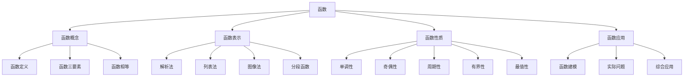

# 📐 函数 - 教学指南

## 🎯 教学总览

**函数**是现代数学的核心概念，是描述变量之间依赖关系的数学模型。函数思想贯穿整个高中数学，是学习其他数学内容的基础。本教案体系按照"概念-要素-性质-应用"的逻辑顺序编排。

### 📊 知识地图

## 📚 章节导航

### 第一章：函数的概念 (4课时)
- **1.1** [[1.函数定义.md|函数的定义]] 🌟🌟
  - 函数的定义
  - 映射的概念
  - 函数与映射的关系
  
- **1.2** [[2.函数的三要素.md|函数的三要素]] 🌟🌟
  - 定义域
  - 值域
  - 对应法则
  - 函数相等的条件

### 第二章：函数的表示方法 (3课时)
- **2.1** 函数的表示方法 🌟🌟
  - 解析法
  - 列表法
  - 图像法
  - 分段函数

### 第三章：函数的性质 (8课时)
- **3.1** [[3.函数性质.md|函数的性质]] 🌟🌟🌟
  - 单调性的定义
  - 奇偶性的定义
  - 周期性的定义
  
- **3.2** [[4.函数性质例题（选择题）.md|函数性质例题]] 🌟🌟🌟🌟
  - 性质综合应用
  - 选择题解题技巧
  - 常见题型分析

### 第四章：基本初等函数 (3课时)
- **4.1** 一次函数与二次函数 🌟🌟
  - 图像和性质
  - 应用举例
  
- **4.2** 幂函数、指数函数、对数函数 🌟🌟🌟
  - 定义和性质
  - 图像特征
  
- **4.3** 三角函数 🌟🌟🌟
  - 基本三角函数
  - 性质和应用

## 🎨 教学资源

### 📖 参考资料
- 人教版高中数学必修一
- 《函数与方程解题技巧》
- 《函数思想方法》

### 🛠 教学工具
- 函数图像绘制软件
- 动态几何软件
- 函数性质演示工具

### 📝 练习题库
- 基础练习题 (50题)
- 提高练习题 (35题)
- 高考真题精选 (30题)
- 竞赛拓展题 (15题)

## 🚀 教学建议

### 课时安排建议
| 章节 | 课时 | 重点 | 难点 |
|------|------|------|------|
| 1.函数概念 | 4 | 三要素理解 | 对应法则 |
| 2.表示方法 | 3 | 图像表示 | 分段函数 |
| 3.函数性质 | 8 | 单调奇偶 | 综合应用 |
| 4.基本函数 | 3 | 性质掌握 | 图像变换 |

### 📊 能力培养
1. **抽象概括能力** - 通过函数概念形成
2. **数形结合能力** - 通过函数图像分析
3. **逻辑推理能力** - 通过性质证明训练
4. **建模应用能力** - 通过实际问题解决

### ⚠️ 常见易错点
- 函数定义域求解错误
- 单调区间端点处理
- 奇偶性判断方法混淆
- 分段函数值域求解

## 🔗 相关链接

### 横向联系
- [[../三角函数/|三角函数]] - 特殊函数类型
- [[../平面向量/|平面向量]] - 向量值函数基础
- [[../复数/|复数]] - 复变函数基础

### 纵向延伸
- 函数概念 → 初等函数 → 高等函数
- 函数性质 → 微积分基础 → 数学分析

## 📈 评价体系

### 形成性评价
- 课堂练习 (25%)
- 概念理解 (30%)
- 作业完成 (30%)

### 终结性评价
- 单元测试 (15%)
- 综合应用 (20%)
- 创新思维 (5%)

## 💡 教学创新

### 数字化教学
- 使用动态软件演示函数图像变化
- 开发函数性质验证小程序
- 利用数据可视化展示函数关系

### 项目式学习
- "生活中的函数关系" - 函数建模
- "函数图像艺术" - 数学与艺术结合
- "最优方案设计" - 函数最值应用

### 个性化学习
- 分层练习题设计
- 错题自动分析
- 学习路径个性化推荐

---

## 🔄 更新记录

| 日期 | 版本 | 更新内容 | 更新人 |
|------|------|----------|--------|
| 2026-04-12 | 1.0 | 创建函数教学指南框架 | 许宏杰 |

## 📞 反馈与建议

如有任何教学建议或发现错误，请通过以下方式反馈：
- 直接在对应教案文件上修改
- 联系作者：许宏杰

---

> **教学箴言**：函数是描述变化世界的数学语言，让学生在变化中寻找规律，在规律中理解世界。

---
*本索引文件基于许宏杰老师的教学实践整理。*