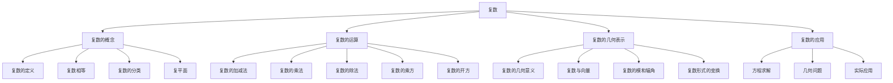

# 📐 复数 - 教学指南

## 🎯 教学总览

**复数**是数学的重要扩展，将实数域扩展到复数域，解决了负数开平方的问题。复数是沟通代数与几何的重要工具，在工程、物理、信号处理等领域有广泛应用。本教案体系按照"概念-运算-几何-应用"的逻辑顺序编排。

### 📊 知识地图

## 📚 章节导航

### 第一章：复数的概念 (3课时)
- **1.1** [[1.复数的概念.md|复数的概念]] 🌟
  - 复数的定义和形式
  - 实部和虚部
  - 复数相等条件
  
- **1.2** [[2.复数的几何意义.md|复数的几何意义]] 🌟🌟
  - 复平面的概念
  - 复数的几何表示
  - 实数轴和虚数轴

### 第二章：复数的代数运算 (5课时)
- **2.1** [[3.复数的加减运算.md|复数的加减运算]] 🌟🌟
  - 加减法的定义
  - 加减法的几何意义
  
- **2.2** [[4.复数的乘除运算.md|复数的乘除运算]] 🌟🌟🌟
  - 乘除法的定义
  - 共轭复数的概念
  - 复数除法技巧

### 第三章：复数的几何性质 (2课时)
- **3.1** 复数的模和辐角 🌟🌟🌟
  - 模长的定义和性质
  - 辐角的概念
  - 复数的三角形式

### 第四章：复数的应用 (2课时)
- **4.1** 复数在方程中的应用 🌟🌟🌟
  - 复数方程求解
  - 实系数二次方程

## 🎨 教学资源

### 📖 参考资料
- 人教版高中数学选修2-2
- 《复数与复变函数基础》
- 《复数的几何意义与应用》

### 🛠 教学工具
- 复平面绘制软件
- 复数运算动态演示
- 几何变换模拟工具

### 📝 练习题库
- 基础练习题 (40题)
- 提高练习题 (25题)
- 高考真题精选 (20题)
- 竞赛拓展题 (10题)

## 🚀 教学建议

### 课时安排建议
| 章节 | 课时 | 重点 | 难点 |
|------|------|------|------|
| 1.复数的概念 | 3 | 复数定义 | 复平面理解 |
| 2.代数运算 | 5 | 四则运算 | 复数除法 |
| 3.几何性质 | 2 | 模和辐角 | 复数形式转换 |
| 4.应用 | 2 | 方程求解 | 综合问题 |

### 📊 能力培养
1. **抽象思维能力** - 通过虚数单位引入
2. **数形结合能力** - 通过复平面表示
3. **运算求解能力** - 通过复数运算训练
4. **知识迁移能力** - 通过复数与向量联系

### ⚠️ 常见易错点
- 混淆实部与虚部的概念
- 复数相等条件应用错误
- 共轭复数性质记忆不清
- 复数除法运算错误

## 🔗 相关链接

### 横向联系
- [[../平面向量/|平面向量]] - 复数的几何表示
- [[../三角函数/|三角函数]] - 复数的三角形式
- [[../函数/|函数]] - 复变函数的基础

### 纵向延伸
- 复数基础 → 复变函数 → 复分析
- 复数几何 → 欧拉公式 → 傅里叶变换

## 📈 评价体系

### 形成性评价
- 课堂练习 (30%)
- 概念理解 (25%)
- 作业完成 (30%)

### 终结性评价
- 单元测试 (15%)
- 综合应用 (20%)
- 创新思维 (5%)

## 💡 教学创新

### 数字化教学
- 使用复平面动态演示复数运算
- 开发复数计算小程序
- 利用几何软件展示复数变换

### 项目式学习
- "复数在电路分析中的应用"
- "复数的几何变换与艺术"
- "复数与分形图形"

### 个性化学习
- 分层练习题设计
- 可视化学习路径
- 概念理解检测

---

## 🔄 更新记录

| 日期 | 版本 | 更新内容 | 更新人 |
|------|------|----------|--------|
| 2026-04-12 | 1.0 | 创建复数教学指南框架 | 许宏杰 |

## 📞 反馈与建议

如有任何教学建议或发现错误，请通过以下方式反馈：
- 直接在对应教案文件上修改
- 联系作者：许宏杰

---

> **教学箴言**：复数是数学想象的翅膀，在虚实之间开拓思维的新天地。

---
*本索引文件基于许宏杰老师的教学实践整理。*