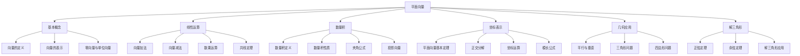

# 📐 平面向量 - 教学指南

## 🎯 教学总览

**平面向量**是沟通代数与几何的重要桥梁，是高中数学的核心内容。向量既有大小又有方向，是研究物理、工程和计算机图形学的重要工具。本教案体系按照"概念-运算-应用"的逻辑顺序编排。

### 📊 知识地图

## 📚 章节导航

### 第一章：向量的基本概念 (3课时)
- **1.1** [[1.向量的概念.md|向量的概念]] 🌟
  - 向量的定义和特征
  - 向量的表示方法
  - 零向量与单位向量

### 第二章：向量的线性运算 (5课时)
- **2.1** [[2.向量的加法运算.md|向量的加法运算]] 🌟🌟
  - 三角形法则和平行四边形法则
  - 加法运算律
  
- **2.2** [[3.向量的减法运算.md|向量的减法运算]] 🌟🌟
  - 减法的几何意义
  - 相反向量
  
- **2.3** [[4.向量的数乘运算.md|向量的数乘运算]] 🌟🌟🌟
  - 数乘的定义和性质
  - 共线向量判定
  
- **2.4** [[5.向量的共线定理.md|向量的共线定理]] 🌟🌟🌟
  - 共线定理的内容
  - 三点共线的判定

### 第三章：平面向量基本定理 (3课时)
- **3.1** [[8.平面向量的基本定理.md|平面向量的基本定理]] 🌟🌟🌟
  - 基本定理的内容
  - 基底的概念
  
- **3.2** [[9.平面向量的正交分解及坐标表示.md|正交分解及坐标表示]] 🌟🌟🌟
  - 正交基的概念
  - 向量的坐标表示

### 第四章：向量的数量积 (4课时)
- **4.1** [[6.数量积.md|数量积]] 🌟🌟🌟🌟
  - 数量积的定义
  - 几何意义
  
- **4.2** [[7.数量积的运算律和运算性质.md|数量积的运算律和性质]] 🌟🌟🌟🌟
  - 运算律和性质
  - 夹角公式
  
- **4.3** [[11.平面向量坐标运算---数量积.md|坐标运算-数量积]] 🌟🌟🌟🌟
  - 坐标形式的数量积
  - 模长和夹角计算

### 第五章：平面向量的应用 (3课时)
- **5.1** [[10.平面向量的坐标运算---数乘.md|坐标运算-数乘]] 🌟🌟🌟
  - 数乘的坐标运算
  
- **5.2** [[12向量在几何中的应用.md|向量在几何中的应用]] 🌟🌟🌟🌟
  - 证明平行和垂直
  - 解决几何问题

### 第六章：解三角形 (5课时)
- **6.1** [[13.余弦定理.md|余弦定理]] 🌟🌟🌟
  - 余弦定理的内容
  - 应用举例
  
- **6.2** [[14.正弦定理.md|正弦定理]] 🌟🌟🌟
  - 正弦定理的内容
  - 应用举例
  
- **6.3** [[15.解三角形应用一.md|解三角形应用一]] 🌟🌟🌟🌟
  - 实际问题的建模
  
- **6.4** [[16.解三角形应用二.md|解三角形应用二]] 🌟🌟🌟🌟
  - 综合应用问题

## 🎨 教学资源

### 📖 参考资料
- 人教版高中数学必修二
- 《平面向量解题技巧》
- 《向量与几何证明》

### 🛠 教学工具
- 几何画板动态演示
- 向量运算模拟软件
- 物理问题情境创设

### 📝 练习题库
- 基础练习题 (60题)
- 提高练习题 (40题)
- 高考真题精选 (30题)
- 竞赛拓展题 (15题)

## 🚀 教学建议

### 课时安排建议
| 章节 | 课时 | 重点 | 难点 |
|------|------|------|------|
| 1.基本概念 | 3 | 向量特征 | 方向理解 |
| 2.线性运算 | 5 | 运算法则 | 数乘应用 |
| 3.基本定理 | 3 | 基底概念 | 正交分解 |
| 4.数量积 | 4 | 数量积计算 | 夹角问题 |
| 5.几何应用 | 3 | 几何证明 | 综合应用 |
| 6.解三角形 | 5 | 定理应用 | 实际问题 |

### 📊 能力培养
1. **抽象思维能力** - 通过向量概念的理解
2. **运算求解能力** - 通过向量运算训练
3. **几何直观能力** - 通过向量与几何的联系
4. **建模应用能力** - 通过实际问题解决

### ⚠️ 常见易错点
- 混淆向量与数量的区别
- 向量运算的几何意义理解不清
- 数量积公式记忆错误
- 坐标运算中的正负号处理

## 🔗 相关链接

### 横向联系
- [[../立体几何初步/|立体几何初步]] - 空间向量的基础
- [[../三角函数/|三角函数]] - 解三角形的工具
- [[../函数/|函数]] - 向量函数的概念

### 纵向延伸
- 平面向量 → 空间向量 → 向量分析
- 向量代数 → 线性代数 → 高等数学

## 📈 评价体系

### 形成性评价
- 课堂练习 (30%)
- 小组讨论 (20%)
- 作业完成 (30%)

### 终结性评价
- 单元测试 (20%)
- 综合应用 (30%)
- 创新思维 (10%)

## 💡 教学创新

### 数字化教学
- 使用动态几何软件演示向量运算
- 开发向量运算小程序
- 利用AR技术展示向量方向

### 项目式学习
- "物理力的合成与分解" - 向量加法应用
- "导航路径规划" - 向量减法应用
- "机械臂运动分析" - 向量综合应用

### 个性化学习
- 分层练习题设计
- 可视化学习路径
- 自适应学习建议

---

## 🔄 更新记录

| 日期 | 版本 | 更新内容 | 更新人 |
|------|------|----------|--------|
| 2026-04-12 | 1.0 | 创建平面向量教学指南框架 | 许宏杰 |

## 📞 反馈与建议

如有任何教学建议或发现错误，请通过以下方式反馈：
- 直接在对应教案文件上修改
- 联系作者：许宏杰

---

> **教学箴言**：向量是连接代数与几何的桥梁，让学生在运算中感受几何，在几何中理解运算。

---
*本索引文件基于许宏杰老师的教学实践整理。*