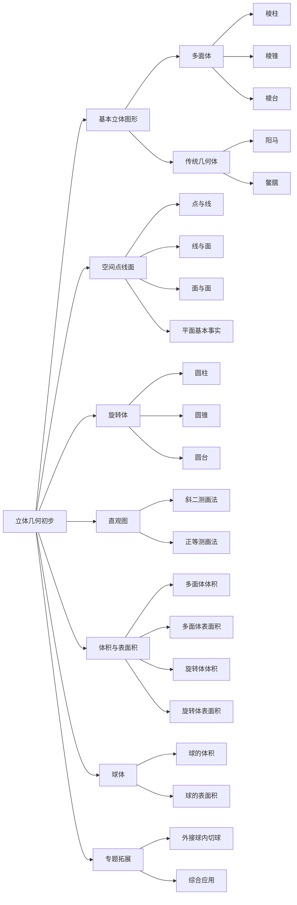

# 📐 立体几何初步 - 教学指南

## 🎯 教学总览

**立体几何初步**是高中数学的重要内容，帮助学生从平面几何过渡到空间几何，培养空间想象能力和逻辑推理能力。本教案体系按照"认知-理解-应用"的逻辑顺序编排，适合高中一年级学生使用。

### 📊 知识地图

## 📚 章节导航

### 第一章：基本立体图形 (2课时)
- **1.1** [[1基本立体图形.md|基本立体图形]] 🌟
  - 多面体的概念与分类
  - 旋转体的概念与特征
  - 正多面体的认识

- **1.2** [[阳马和鳖臑.md|阳马和鳖臑]] 🌟🌟
  - 传统几何体的认识
  - 古代数学中的立体几何
  - 空间结构的理解

### 第二章：空间点、直线、平面 (4课时)
- **2.1** [[4.平面.md|平面及其性质]] 🌟🌟
  - 平面的概念
  - 平面的表示方法
  - 平面的基本性质

- **2.2** [[7.平面.md|平面基本事实]] 🌟🌟🌟
  - 基本事实1：点与平面的关系
  - 基本事实2：直线在平面内的判定
  - 基本事实3：两平面相交的性质
  - [[20260412001|平面画法图示]]
  - [[20260412002|基本事实1图示]]
  - [[Excalidraw/20260412003|基本事实2图示]]
  - [[20260412004|基本事实3图示]]
  - [[20260412005|其他相关图示]]

### 第三章：旋转体 (2课时)
- **3.1** [[2.旋转体.md|旋转体]] 🌟🌟
  - 圆柱、圆锥、圆台的结构
  - 旋转体的生成过程
  - 旋转体的截面特征

### 第四章：直观图 (2课时)
- **4.1** [[3.直观图.md|直观图]] 🌟🌟
  - 斜二测画法
  - 正等测画法
  - 空间图形的平面表示

### 第五章：体积与表面积 (5课时)
- **5.1** [[4.多面体的体积和表面积.md|多面体的体积和表面积]] 🌟🌟🌟
  - 柱体、锥体、台体的体积公式
  - 多面体表面积的计算
  - 组合体的处理

- **5.2** [[5.表面积和体积2.md|表面积和体积进阶]] 🌟🌟🌟🌟
  - 复杂组合体的计算
  - 体积比与表面积比
  - 空间优化问题

### 第六章：球体 (3课时)
- **6.1** [[6.球的体积和表面积.md|球的体积和表面积]] 🌟🌟🌟
  - 球的基本性质
  - 球的体积公式推导
  - 球的表面积公式

### 第七章：专题拓展 (2课时)
- **7.1** [[专题四面体的外接球和内切球.md|外接球与内切球]] 🌟🌟🌟🌟
  - 多面体的外接球
  - 多面体的内切球
  - 球与多面体的位置关系

## 🎨 教学资源

### 📖 参考资料
- 人教版高中数学必修二
- 《立体几何解题技巧》
- 《空间想象能力训练》

### 🛠 教学工具
- 几何画板动态演示
- 3D打印模型展示
- 虚拟现实(VR)空间体验
- Excalidraw绘图工具（已创建多个教学图示）

### 📝 练习题库
- 基础练习题 (50题)
- 提高练习题 (30题)
- 高考真题精选 (20题)
- 竞赛拓展题 (10题)

## 🚀 教学建议

### 课时安排建议
| 章节 | 课时 | 重点 | 难点 |
|------|------|------|------|
| 1.基本立体图形 | 2 | 多面体分类 | 空间想象 |
| 2.空间点线面 | 4 | 平面性质 | 基本事实应用 |
| 3.旋转体 | 2 | 旋转体特征 | 截面分析 |
| 4.直观图 | 2 | 画法规则 | 空间还原 |
| 5.体积表面积 | 5 | 公式应用 | 组合体 |
| 6.球体 | 3 | 球的性质 | 外接球 |
| 7.专题拓展 | 2 | 综合应用 | 空间推理 |

### 📊 能力培养
1. **空间想象能力** - 通过模型观察和图形绘制
2. **逻辑推理能力** - 通过定理证明和公式推导
3. **计算应用能力** - 通过实际问题解决
4. **创新思维能力** - 通过开放性问题探索

### ⚠️ 常见易错点
- 混淆棱柱与棱锥的侧棱概念
- 旋转体侧面展开图的计算错误
- 球的外接、内切问题理解偏差
- 组合体体积计算的重复或遗漏
- 平面基本事实的几何意义理解不清

## 🔗 相关链接

### 横向联系
- [[../平面向量/|平面向量]] - 向量的空间应用
- [[../三角函数/|三角函数]] - 空间角的计算
- [[../函数/|函数]] - 最值问题的函数方法

### 纵向延伸
- 立体几何 → 空间向量 → 解析几何
- 基础立体 → 空间位置关系 → 空间角与距离

## 📈 评价体系

### 形成性评价
- 课堂提问 (20%)
- 小组讨论 (20%)
- 作业完成 (30%)

### 终结性评价
- 单元测试 (30%)
- 综合应用 (20%)
- 创新思维 (10%)

### 能力评价
| 能力维度 | 评价标准 | 权重 |
|----------|----------|------|
| 空间想象 | 能正确识别和绘制立体图形 | 30% |
| 计算应用 | 能准确计算体积和表面积 | 30% |
| 推理证明 | 能进行简单的空间推理 | 20% |
| 问题解决 | 能解决实际空间问题 | 20% |

## 💡 教学创新

### 数字化教学
- 使用几何画板制作动态演示
- 利用3D软件展示空间结构
- 开发交互式学习小程序
- 使用Excalidraw创建教学图示

### 项目式学习
- "设计最优包装" - 体积与表面积应用
- "建筑模型制作" - 空间结构理解
- "数学史探究" - 阳马、鳖臑的古代应用

### 个性化学习
- 分层练习题设计
- 可视化学习路径
- 自适应学习建议

---

## 🔄 更新记录

| 日期 | 版本 | 更新内容 | 更新人 |
|------|------|----------|--------|
| 2026-04-12 | 1.1 | 更新章节导航，添加平面基本事实章节和Excalidraw文件链接 | 许宏杰 |
| 2026-04-11 | 1.0 | 创建索引文件，建立完整教学框架 | 许宏杰 |
| 2026-03-30 | 0.9 | 完成基础教案编写 | 许宏杰 |

## 📞 反馈与建议

如有任何教学建议或发现错误，请通过以下方式反馈：
- 直接在对应教案文件上修改
- 在[[7.平面|教学反思]]中记录
- 联系作者：许宏杰

---

> **教学箴言**：立体几何的学习不仅是知识的积累，更是空间思维的训练。让学生在"看"中思考，在"做"中理解，在"用"中创新。

---
*本索引文件由白泽AI助手协助创建和更新，基于许宏杰老师的教学实践整理。*