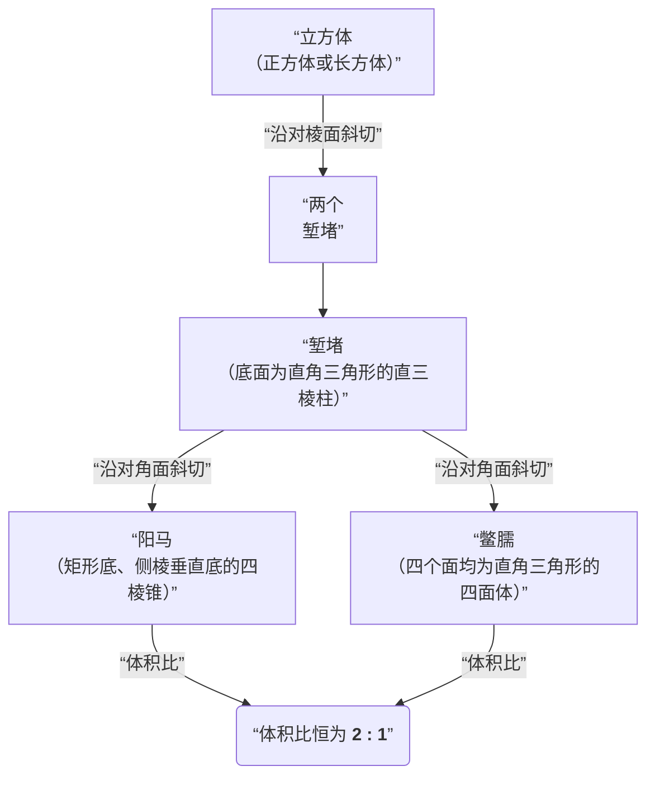

“阳马”和“鳖臑”是我国古代数学中两个非常形象的立体几何名称，它们源自经典算经《九章算术》。

简单来说，**阳马是底面为矩形、一条棱垂直于底面的四棱锥，而鳖臑是所有面都是直角三角形的四面体（即三棱锥）**。它们之间，以及和另一个基本几何体“堑堵”之间，存在着可以相互分割与组合的紧密关系。

---

### 基本定义

| 名称 | 读音 | 现代几何定义 | 形象理解 |
| :--- | :--- | :--- | :--- |
| **堑堵** | qiàn dǔ | 底面为直角三角形的**直三棱柱** | 将一个长方体沿相对棱切开得到的一半 |
| **阳马** | yáng mǎ | 底面为**矩形**，且一条**侧棱垂直于底面**的四棱锥 | 形状像古代房屋角落的角梁 |
| **鳖臑** | biē nào | 所有面（四个面）都是**直角三角形**的四面体 | 形状像“鳖”（甲鱼）的“臑”（前腿，音同“闹”），俗称“别闹” |

---

### 核心关系：分合与体积

它们之间的关系可以用《九章算术》中的一句话概括：**“斜解立方，得两堑堵。斜解堑堵，其一为阳马，一为鳖臑。阳马居二，鳖臑居一，不易之率也。”**

这句话揭示了一个完美的几何分割过程，也给出了一个恒定的体积比例：

1.  **立方分堑堵**：将一个正方体（或长方体）沿对角面斜切，得到两个形状相同的**堑堵**（底面为直角三角形的三棱柱）。
2.  **堑堵分阳马、鳖臑**：再将一个堑堵沿对角面斜切，会得到一个**阳马**和一个**鳖臑**。
3.  **恒定的体积比**：在任何一次这样的分割中，**阳马的体积总是鳖臑体积的2倍**。这个2:1的比例是恒定不变的，被称为“不易之率”。

*   堑堵的体积是原立方体的一半。
*   因此，阳马的体积是原立方体的 \( \frac{1}{3} \)，鳖臑的体积是原立方体的 \( \frac{1}{6} \) 。

这个关系，其实用一张图就能看得很清楚：

### 几何学意义

这套“堑堵、阳马、鳖臑”的模型，是古代数学家（特别是魏晋时期的刘徽）推导各种多面体体积公式的关键工具。他通过将复杂的立体图形无限分割成这些基本单元，并用极限思想证明了它们的体积关系，这一方法在数学史上具有重要地位，被称为**刘徽原理**。

---

“鳖臑”这个今天看起来有些生僻的词，曾在2015年湖北高考数学卷中作为一道立体几何题的背景出现，当时因为读音与“别闹”相似，在网络上引起了不小的讨论。

所以，下次再听到“别闹”，可以会心一笑，这其实是中国古人严谨几何智慧的体现。