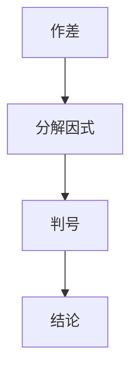

**题目**$已知a>b>0,求证：a^5-b^5>a^3b^2-a^2b^3$
解析
$a^5-b^5-(a^3b^2-a^2b^3)=a^5-a^3b^2-(b^5-a^2b^3)$
$=a^3(a^2-b^2)-b^3(b^2-a^2)$
$=(a^2-b^2)(a^3+b^3)$
$=(a-b)(a+b)(a^3+b^3)$
$\because a>b>0$
$\therefore a-b>0,a+b>0,a^3+b^3>0$
$\therefore 原不等式成立$

