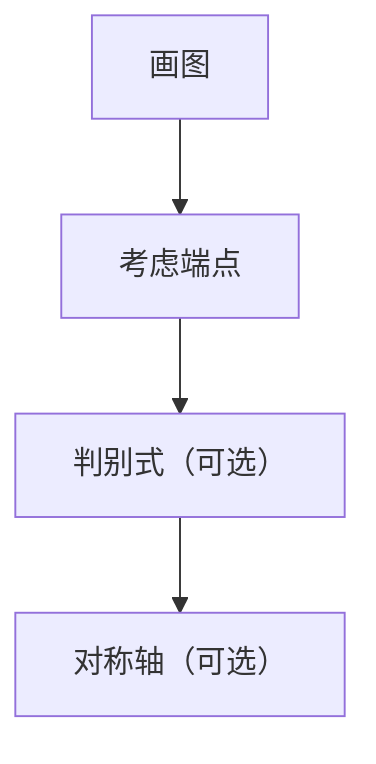

已知$函数f(x)=x^2-2(a+1)x+4在区间[\frac{1}{2},3]上有两个零点，求a的取值范围$

解析：
![[Pasted image 20251210090928.png]]
$图像过定点(0,4),\therefore \begin{cases}f(\frac{1}{2})>0\\f(3)>0\\\frac{1}{2}<(a+1)<3\\\Delta=4(a+1)^2-16>0\end{cases}$
$可得1<a\le \frac{7}{6}$
$\color{red}对比还是分离参数发更佳$

