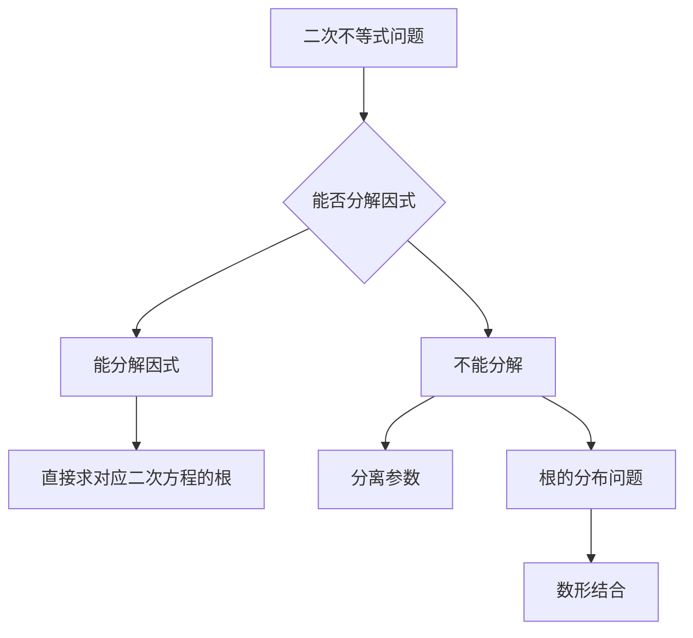

**题目1**$集合A=\{x|x^2-2kx+k^2-1\le0\},B=[-2,3],A\subsetneqq B,求k的取值范围$

解析：
利用因式分解方法直接简单
$A=\{x|(x-k+1)(x-k-1)\le 0\}=[k-1,k+1]$
$\begin{cases} k-1\ge -2\\k+1\le 3\end{cases}$
$\therefore -1\le k\le 2$
$\color{red}以此题为基础可以进行很多的改变，你能想到吗$

