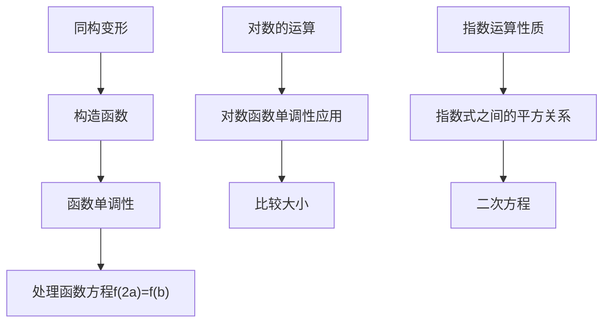

>[!success] 指对运算综合问题
>$已知a,b\in(0,1)\cup(1,+\infty),且9^a-\log_2b=3^b-\log_2(2a),则()$
>- [ ] $A.b=a^2$
>- [x] $B.当|\log_2a|=|\log_2b|时，b-a=\frac{\sqrt2}{2}$
>- [x] $C.当\log_a(a^2+1)<\log_ab<0时，a的取值范围是(\frac{1}{2},1)$
>- [ ] $D.当a^m=x,(\sqrt2a)^m=y,b^m=x+y时,\frac{x}{y}=\frac{\sqrt5+2}{2}$

>[!分析与解答]-
>$1.9^a可以变为3^{2a},观察指数和真数$
>$2.探索那个结构更合理$
>>$3^{2a}-3^b=-\log_2(2a)+\log_2b$
>>$3^{2a}+\log_2(2a)=3^b+\log_2b$

---

>[!continue]-
>第二个结构更合理（==两边结构完全相同==）
>$设函数f(x)=3^x+\log_2x$
>$可得f(2a)=f(b)$
>(这是一种逆向思维)
>$函数f(x)=3^x+\log_2x在区间(0,+\infty)为增函数$
>$\therefore 2a=b\neq1$
>(这也是单调性所具有一个功能)
>

$\color{red}发现a，b间的关系是解决本题的关键$

---
>[!continue]-
>$对于选项B$
>$\begin{cases}b=2a\\|\log_2a|=|\log_2b|\end{cases}$
>$\log_2a=\log_2b或\log_2a=-\log_2b$
>$b=a(舍)或b=\frac{1}{a}$
>$\therefore b=2a=\frac{1}{a}\Rightarrow 2a^2=1$

考查对数的基本运算

---
>[!continue]-
>$对于选项C$
>$\log_a(a^2+1)<\log_ab<0$
>$可以分解为三个不等式$
>>$\begin{cases}\log_a(a^2+1)<0...①\\\log_ab<0...②\\\log_a(a^2+1)<\log_ab...③\end{cases}$
>分别处理
>$对于①\because a^2+1>1\therefore 0<a<1$
>$对于②\because 0<a<1\therefore b>1$
>$对于③\because 0<a<1\therefore a^2+1>b$
>$又\because b=2a$
>$\therefore \begin{cases}0<a<1\\2a>1\\a^2+1>2a\end{cases}\Rightarrow \frac{1}{2}<a<1$

对数函数的+符号的准确判定

---
>[!continue]-
>$对于选项D$
>$\begin{cases}a^m=x\\(\sqrt2a)^m=y\\b^m=x+y\\b=2a\end{cases}\Rightarrow \begin{cases}a^m=x\\(\sqrt2)^ma^m=y\\2^ma^m=x+y\end{cases}$
>$\begin{cases}(\sqrt2)^m=\frac{y}{x}\\2^m=\frac{x+y}{x}\end{cases}\Rightarrow (\frac{y}{x})^2=\frac{x+y}{x}$
>$(\frac{y}{x})^2-\frac{y}{x}-1=0\Rightarrow \frac{y}{x}=\frac{1+\sqrt5}{2}或\frac{y}{x}=\frac{1\sqrt5}{2}(舍)$
>$\frac{x}{y}=\frac{2}{\sqrt5+1}=\frac{\sqrt5-1}{2}$

指数运算性质+方程处理+有理化运算

---

>[!help] 应用知识方法图表

---
参考[[构造函数比大小]]