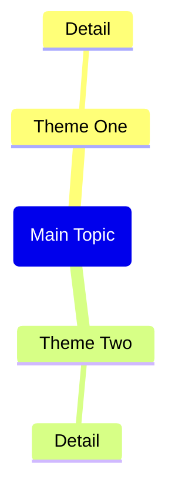

# 题目

## 题干

<!-- 原始内容开始 -->
---
copilot-command-context-menu-enabled: false
copilot-command-slash-enabled: true
copilot-command-context-menu-order: 1140
copilot-command-model-key: ""
copilot-command-last-used: 0
---

Based on the web page content provided in the context (from Obsidian Web Clipper or Web Viewer), generate a complete Obsidian note.

IMPORTANT: If no web page context is found, remind the user to:
1. Open a web page in Web Viewer (or use @ to select a web tab)
2. Or open a note clipped by Obsidian Web Clipper
3. Then use this command again

Generate the note with this exact structure:

---
title: "<page title>"
source: "<page url>"
description: "<brief description>"
tags:
  - "clippings"
---

## Summary

<Brief 2-3 paragraph summary of the page content>

## Key Takeaways

<List 5-8 key takeaways as bullet points>

## Mindmap

CRITICAL Mermaid mindmap syntax rules - MUST follow exactly:
- Root node format: root(Topic Name) - use round brackets, NO double brackets
- Child nodes: just plain text, no brackets needed
- Do NOT use quotes, parentheses, brackets, or any special characters in text
- Keep all node text short and simple - max 3-4 words per node

## Notable Quotes

<List 3-5 notable quotes from the content, if any>

Return only the markdown content without any explanations or comments.
<!-- 原始内容结束 -->

## 条件翻译
<!-- 自动生成或手动补充 -->

## 解题思路提示（可选）
> [!hint]- 思路提示
> 1. 
> 2. 
> 3. 

# 解答

## 完整解答
<!-- 解答内容待补充 -->

## 关键步骤
1. 
2. 
3. 

## 易错点分析
> [!warning]- 易错点1：
> 

# 知识点

## 核心知识点
- 

## 关联知识点链接
- 

## 常见变式
1. 

# 教学应用

## 课堂引入建议

## 分层教学建议

## 作业设计

---
*原始文件: Clip Web Page.md*
*迁移时间: Mon Apr 20 11:32:16 CST 2026*
