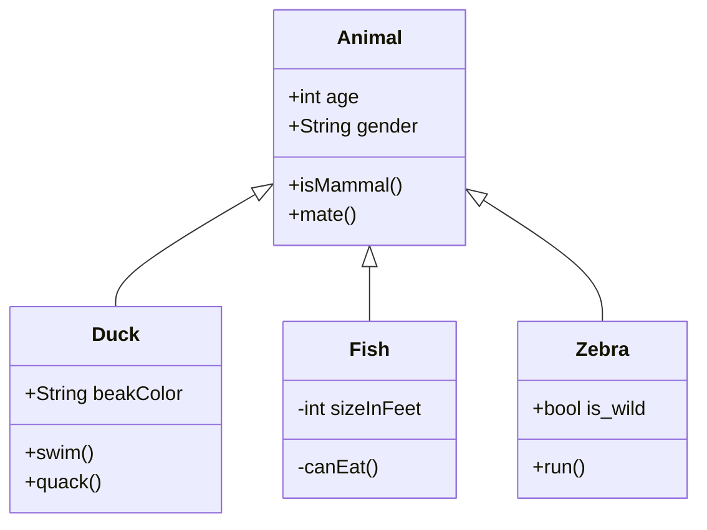
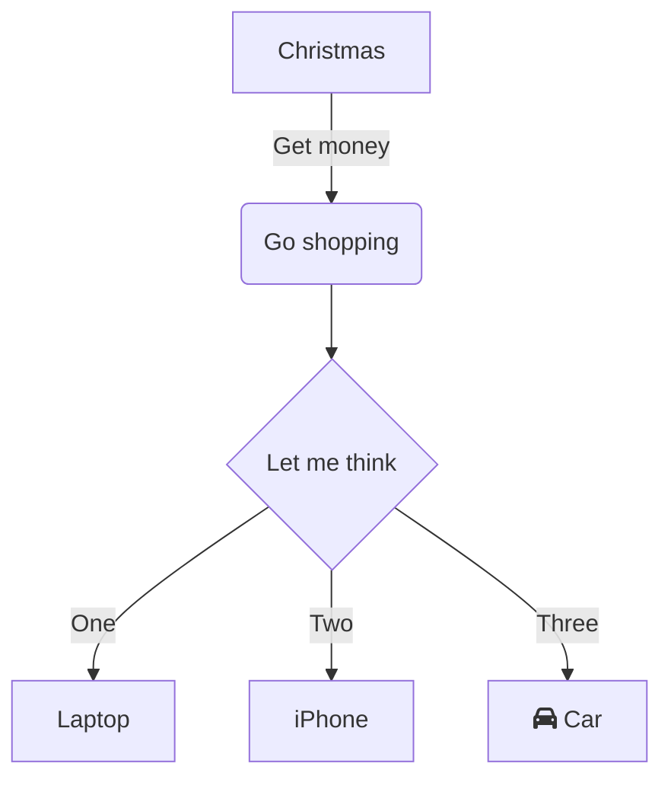
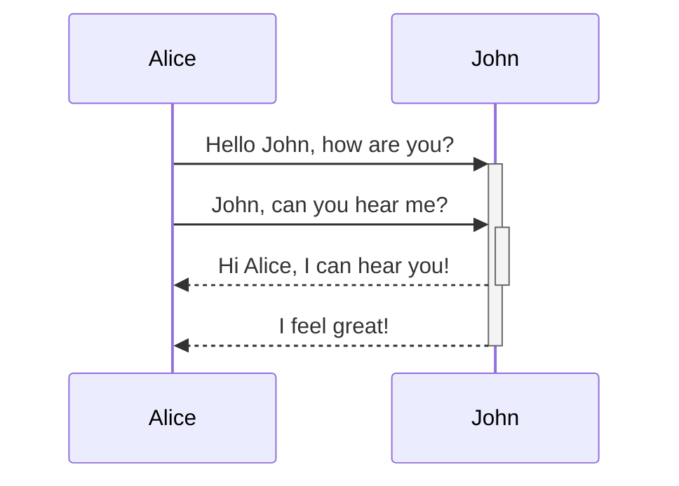
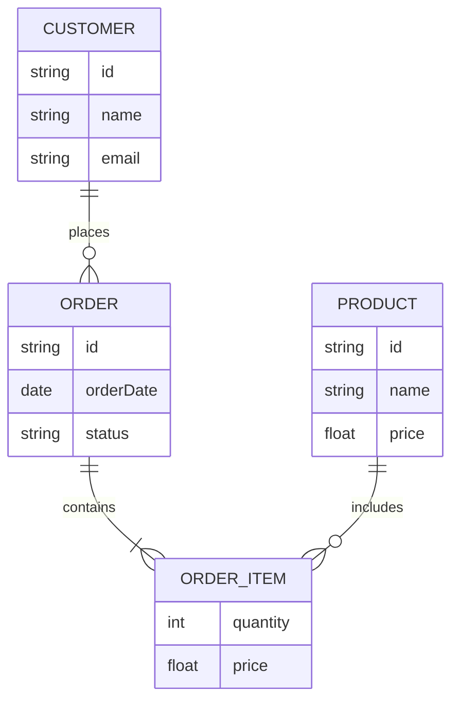
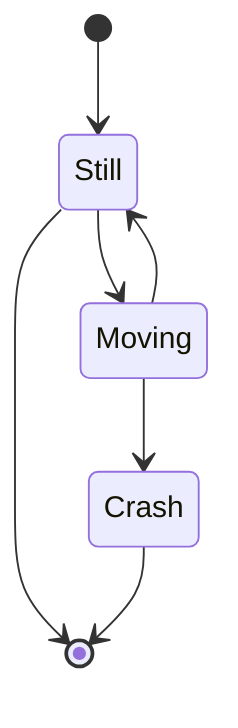
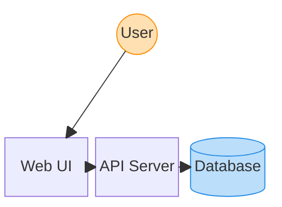
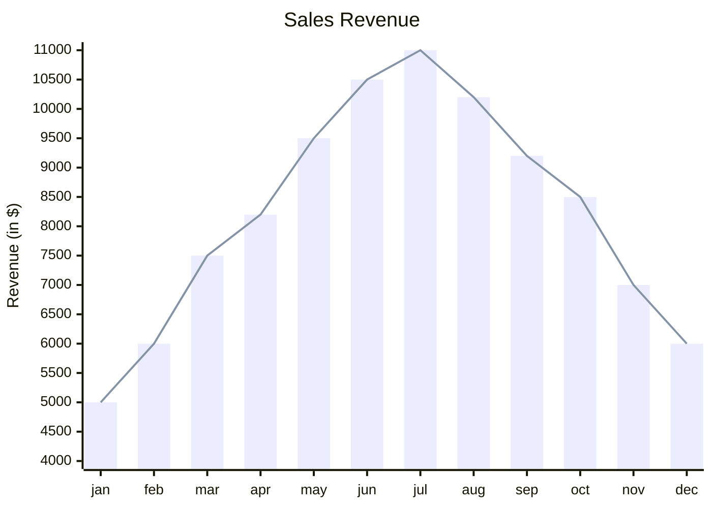

```mermaid
mindmap

  root((mindmap))

    Origins

      Long history

      ::icon(fa fa-book)

      Popularisation

        British popular psychology author Tony Buzan

    Research

      On effectiveness<br/>and features

      On Automatic creation

        Uses

            Creative techniques

            Strategic planning

            Argument mapping

    Tools

      Pen and paper

      Mermaid
```




```mermaid
venn-beta
    
    title "Finding the Product Sweet Spot"

    set Desirable

    set Feasible

    set Viable

    union Desirable,Feasible["Worth prototyping"]

    union Feasible,Viable["Cheap to run"]

    union Desirable,Viable["Hard to build"]

    union Desirable,Feasible,Viable["Sweet spot"]
```



